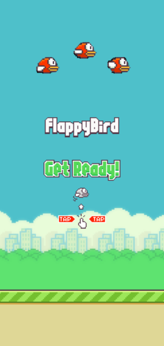

# Flappy Bird




## Description

This project is a simple implementation of the classic Flappy Bird game using Flutter and Flame game development framework. It serves as a fun and educational example of building a mobile game with Flutter and Flame.

## Features

- Classic Flappy Bird gameplay mechanics.
- Simple and intuitive controls.
- Score tracking and display.
- Responsive design for various screen sizes.

## Getting Started

These instructions will help you get a copy of the project up and running on your local machine for development and testing purposes.

### Prerequisites

- Flutter SDK installed. [Flutter Installation Guide](https://flutter.dev/docs/get-started/install)
- A supported IDE (such as Visual Studio Code or Android Studio).

### Installation way 1

1. Clone the repository:

   ```bash
   git clone https://github.com/Midgardsormrm/flappy

2. Navigate to the project directory.
   ```bash
   cd Flappy
   
3. Install dependencies.
   ```bash
   flutter pub get
      
4. Run the app.
   ```bash
   flutter run
   
### Installation way 2
1. Install APK from releases.
   ```bash
   https://github.com/Midgardsormrm/flappy/releases
   
2. Install it on android or move it on android emulator

## Usage
- Tap on the screen to make the bird jump.
- Navigate the bird through the pipes to score points.
- Avoid collision with the pipes and the ground.


## Contributing
Feel free to contribute to the project by opening issues or submitting pull requests. Any contributions are highly appreciated!

## Acknowledgments
- Inspiration: Flappy Bird by Dong Nguyen
- Flame - A minimalist Flutter game engine
